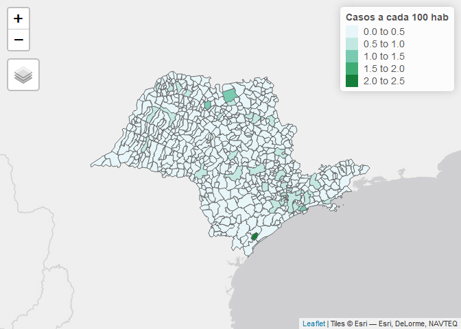
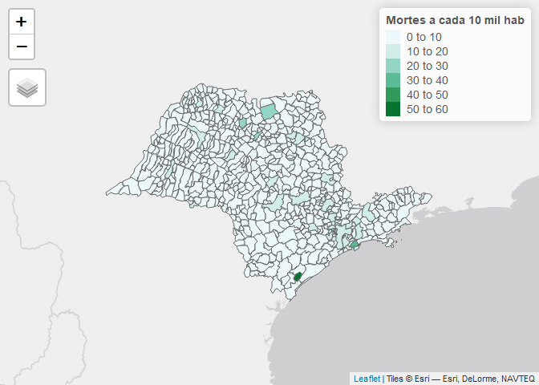

Coronavirus in the São Paulo State: Cases, Deaths and Population
================
Pedro Leite
23/10/2020

Data was acquired on September 15 2020. Thence, we were able to notice
that the cities in which the number of deaths and cases were worst were:
Santos, Barretos, São José do Rio Preto and Pariquera-Açu. This last one
is a real outlier. Even though it is surrounded by an area with the
least amount of cases, Pariquera-Açu has the most concentration of
cases. There is a social-geographical explanation for it: Pariquera-Açú
has the only general hospital of the southern region of the São Paulo
State known as Vale do Ribeira, which is the poorest region ofd the
State. Therefore, we might infer that most of Covid-19 cases from the
surrounding cities are being concentrated at the General Hospital of
Pariquera-Açú, where they get tested and increase the number of cases in
that specific municipality.

Otherwise, Santos, Barretos and São José do Rio Preto all had to have
more restrict rules of circulation compared to their surrounding
municipalities, due to the higher incidence of Covid-19 cases in those
regions. The actual reason for why those cases were so high is unknown,
but it might be cultural.

``` r
library(maps)
library(mapdata)
library(sidrar)
library(geobr)
library(ggplot2)
library(sf)
library(rio)
library(vctrs)
library(dplyr)
  install_formats()
library(sidrar)
library(knitr)
  knitr::opts_chunk$set(echo = TRUE)
#Plot the data in a visually appealling way  
library(RColorBrewer)
library(classInt)
library(tibble)
library(kableExtra)
#for interactive maps
library(tmap)
library(leaflet) 
library(plotly)
library(leaflet.extras)
library(htmlwidgets)
library(htmltools)
library(devtools)
```

## 1\. Testing `geobr` package

``` r
#Municipality of São José dos Campos
muni <- read_municipality(code_muni=3549904, year=2019 )
no_axis <- theme(axis.title=element_blank(),
                 axis.text=element_blank(),
                 axis.ticks=element_blank())

ggplot() +
  geom_sf(data=muni, fill="#2D3E50", color="#FEBF57", size=.15, show.legend = FALSE) +
  labs(subtitle="São José dos Campos", size=8) +
  theme_void() +
  no_axis
```

<!-- -->

``` r
#Neightboorhoods in São José dos Campos
sp_census <- read_census_tract(code_tract="SP", year=2010)
sjc_census <- sp_census[which(sp_census$name_muni=='São José Dos Campos'),]

ggplot() +
  geom_sf(data=sjc_census, fill="#2D3E50", color="#FEBF57", size=.15, show.legend = FALSE) +
  labs(subtitle="São José dos Campos", size=8) +
  theme_void() +
  no_axis
```

<!-- -->

``` r
sp <- read_municipality(code_muni="SP", year=2010)
no_axis <- theme(axis.title=element_blank(),
                 axis.text=element_blank(),
                 axis.ticks=element_blank())

ggplot(data=sp) +
  geom_sf(aes(fill="b"), size=.15, show.legend = FALSE) +
  labs(subtitle="São Paulo", size=8) +
  theme_void() +
  no_axis
```

<!-- -->

## 2\. Maps, Coronavirus and Population

``` r
coronadata <- read.csv2("INFLUD-07-09-2020.csv", 
                        header = TRUE, 
                        stringsAsFactors=TRUE, 
                        na = "NA",
                        dec = ".",
                        sep=";")
```

``` r
pop <- read.csv2("estimativa_dou_2015_20150915.csv", 
                        header = TRUE, 
                        stringsAsFactors=TRUE, 
                        na = "NA",
                        dec = ".",
                        sep=";")
```

``` r
levels(coronadata$SG_UF_NOT)
```

    ##  [1] "AC" "AL" "AM" "AP" "BA" "CE" "DF" "ES" "GO" "MA" "MG" "MS" "MT" "PA"
    ## [15] "PB" "PE" "PI" "PR" "RJ" "RN" "RO" "RR" "RS" "SC" "SE" "SP" "TO"

``` r
#New dataframe with only SP data
spcorona <- coronadata[which(coronadata$SG_UF_NOT=='SP'),]

#merge coronavirus data with sp map
names(sp)
```

    ## [1] "code_muni"    "name_muni"    "code_state"   "abbrev_state"
    ## [5] "geom"

``` r
names(spcorona)
```

    ##   [1] "DT_NOTIFIC" "SEM_NOT"    "DT_SIN_PRI" "SEM_PRI"    "SG_UF_NOT" 
    ##   [6] "ID_REGIONA" "CO_REGIONA" "ID_MUNICIP" "CO_MUN_NOT" "ID_UNIDADE"
    ##  [11] "CO_UNI_NOT" "CS_SEXO"    "DT_NASC"    "NU_IDADE_N" "TP_IDADE"  
    ##  [16] "COD_IDADE"  "CS_GESTANT" "CS_RACA"    "CS_ETINIA"  "CS_ESCOL_N"
    ##  [21] "ID_PAIS"    "CO_PAIS"    "SG_UF"      "ID_RG_RESI" "CO_RG_RESI"
    ##  [26] "ID_MN_RESI" "CO_MUN_RES" "CS_ZONA"    "SURTO_SG"   "NOSOCOMIAL"
    ##  [31] "AVE_SUINO"  "FEBRE"      "TOSSE"      "GARGANTA"   "DISPNEIA"  
    ##  [36] "DESC_RESP"  "SATURACAO"  "DIARREIA"   "VOMITO"     "OUTRO_SIN" 
    ##  [41] "OUTRO_DES"  "PUERPERA"   "FATOR_RISC" "CARDIOPATI" "HEMATOLOGI"
    ##  [46] "SIND_DOWN"  "HEPATICA"   "ASMA"       "DIABETES"   "NEUROLOGIC"
    ##  [51] "PNEUMOPATI" "IMUNODEPRE" "RENAL"      "OBESIDADE"  "OBES_IMC"  
    ##  [56] "OUT_MORBI"  "MORB_DESC"  "VACINA"     "DT_UT_DOSE" "MAE_VAC"   
    ##  [61] "DT_VAC_MAE" "M_AMAMENTA" "DT_DOSEUNI" "DT_1_DOSE"  "DT_2_DOSE" 
    ##  [66] "ANTIVIRAL"  "TP_ANTIVIR" "OUT_ANTIV"  "DT_ANTIVIR" "HOSPITAL"  
    ##  [71] "DT_INTERNA" "SG_UF_INTE" "ID_RG_INTE" "CO_RG_INTE" "ID_MN_INTE"
    ##  [76] "CO_MU_INTE" "UTI"        "DT_ENTUTI"  "DT_SAIDUTI" "SUPORT_VEN"
    ##  [81] "RAIOX_RES"  "RAIOX_OUT"  "DT_RAIOX"   "AMOSTRA"    "DT_COLETA" 
    ##  [86] "TP_AMOSTRA" "OUT_AMOST"  "PCR_RESUL"  "DT_PCR"     "POS_PCRFLU"
    ##  [91] "TP_FLU_PCR" "PCR_FLUASU" "FLUASU_OUT" "PCR_FLUBLI" "FLUBLI_OUT"
    ##  [96] "POS_PCROUT" "PCR_VSR"    "PCR_PARA1"  "PCR_PARA2"  "PCR_PARA3" 
    ## [101] "PCR_PARA4"  "PCR_ADENO"  "PCR_METAP"  "PCR_BOCA"   "PCR_RINO"  
    ## [106] "PCR_OUTRO"  "DS_PCR_OUT" "CLASSI_FIN" "CLASSI_OUT" "CRITERIO"  
    ## [111] "EVOLUCAO"   "DT_EVOLUCA" "DT_ENCERRA" "DT_DIGITA"  "HISTO_VGM" 
    ## [116] "PAIS_VGM"   "CO_PS_VGM"  "LO_PS_VGM"  "DT_VGM"     "DT_RT_VGM" 
    ## [121] "PCR_SARS2"  "PAC_COCBO"  "PAC_DSCBO"  "OUT_ANIM"   "DOR_ABD"   
    ## [126] "FADIGA"     "PERD_OLFT"  "PERD_PALA"  "TOMO_RES"   "TOMO_OUT"  
    ## [131] "DT_TOMO"    "TP_TES_AN"  "DT_RES_AN"  "RES_AN"     "POS_AN_FLU"
    ## [136] "TP_FLU_AN"  "POS_AN_OUT" "AN_SARS2"   "AN_VSR"     "AN_PARA1"  
    ## [141] "AN_PARA2"   "AN_PARA3"   "AN_ADENO"   "AN_OUTRO"   "DS_AN_OUT" 
    ## [146] "TP_AM_SOR"  "SOR_OUT"    "DT_CO_SOR"  "TP_SOR"     "OUT_SOR"   
    ## [151] "DT_RES"     "RES_IGG"    "RES_IGM"    "RES_IGA"

``` r
names(spcorona)[names(spcorona) == "CO_MUN_NOT"] <- "code_muni"
sp_corona <- merge(sp, spcorona, by="code_muni", all=TRUE)
```

``` r
#Edit code_muni in sp to display only 6 digits (instead of 7)
sp$code_muni <- as.numeric(substr(sp$code_muni, 1, 6))

#How many contaminations for each city?
contam_sp <- spcorona %>% 
  group_by(code_muni) %>%
  summarise(no_rows = length(code_muni))

# 1. Insert it into SP state map
sp_coronamap <- merge(sp,contam_sp, by="code_muni", all=TRUE)

#2. Merge pop data with other data GOOD ONE
sp_coronamap_pop <- merge(sp_coronamap,pop, by="name_muni", all=TRUE)
```

## 3\. Iterative maps

``` r
nclr <- 7
plotclr <- brewer.pal(nclr,"Reds")
sp_coronamap_pop[["no_rows"]][is.na(sp_coronamap_pop[["no_rows"]])] <- 0
str(sp_coronamap_pop)
```

    ## Classes 'sf' and 'data.frame':   645 obs. of  10 variables:
    ##  $ name_muni   : Factor w/ 645 levels "Adamantina","Adolfo",..: 1 2 3 4 5 6 7 8 9 10 ...
    ##  $ code_muni   : num  350010 350020 350030 350040 350050 ...
    ##  $ code_state  : Factor w/ 1 level "35": 1 1 1 1 1 1 1 1 1 1 ...
    ##  $ abbrev_state: Factor w/ 1 level "SP": 1 1 1 1 1 1 1 1 1 1 ...
    ##  $ no_rows     : num  112 1 10 0 42 0 1 98 0 0 ...
    ##  $ UF          : Factor w/ 1 level "SP": 1 1 1 1 1 1 1 1 1 1 ...
    ##  $ COD..UF     : int  35 35 35 35 35 35 35 35 35 35 ...
    ##  $ COD..MUNIC  : int  105 204 303 402 501 550 600 709 758 808 ...
    ##  $ pop         : int  35048 3623 34863 8025 18313 5944 3139 36524 5560 4101 ...
    ##  $ geometry    :sfc_MULTIPOLYGON of length 645; first list element: List of 1
    ##   ..$ :List of 1
    ##   .. ..$ : num [1:185, 1:2] -51.1 -51.1 -51.1 -51.1 -51.1 ...
    ##   ..- attr(*, "class")= chr  "XY" "MULTIPOLYGON" "sfg"
    ##  - attr(*, "sf_column")= chr "geometry"
    ##  - attr(*, "agr")= Factor w/ 3 levels "constant","aggregate",..: NA NA NA NA NA NA NA NA NA
    ##   ..- attr(*, "names")= chr  "name_muni" "code_muni" "code_state" "abbrev_state" ...

``` r
sp_coronamap_pop[["pop"]][is.na(sp_coronamap_pop[["pop"]])] <- 0

CASES <- sp_coronamap_pop$no_rows
POP2015 <- sp_coronamap_pop$pop
sp_coronamap_pop$var <- ((CASES/POP2015))*100
class_casos <- classIntervals(sp_coronamap_pop$var, nclr, style="sd")
colcode_casos <- findColours(class_casos, plotclr)

ggplot(data=sp_coronamap_pop) +
  geom_sf(size=.15, color=NA) + geom_sf(aes(fill=var)) +
  scale_fill_viridis_c(direction = -1, limits = c(0, 1.5)) + #escala de cores
  labs(subtitle="São Paulo", size=8, fill="Casos confirmados \na cada 100 hab") +
  theme_void() +
  no_axis
```

<!-- -->

``` r
#How many corona deaths for each city?
spcorona_deaths <- spcorona[spcorona$EVOLUCAO %in% c("2"),]

deaths_sp <- spcorona_deaths %>% 
  group_by(code_muni) %>%
  summarise(deaths = length(code_muni))

#Insert it in SP state map (on previous map)
sp_coronamap <- merge(sp,deaths_sp, by="code_muni", all=TRUE)

#merge pop data with other data
sp_coronamap_pop2 <- merge(sp_coronamap,pop, by="name_muni", all=TRUE)

sp_coronamap_pop2[["deaths"]][is.na(sp_coronamap_pop2[["deaths"]])] <- 0

DEATHS <- sp_coronamap_pop2$deaths
POP2015 <- sp_coronamap_pop2$pop
sp_coronamap_pop2$var_d <- ((DEATHS/POP2015))*10000 #a cada 10 mil hab

class_deaths <- classIntervals(sp_coronamap_pop2$var_d, nclr, style="sd")
colcode_deaths <- findColours(class_deaths, plotclr)

ggplot(data=sp_coronamap_pop2) +
  geom_sf(size=.15, color=NA) + geom_sf(aes(fill=var_d)) +
    scale_fill_viridis_c(direction = -1, limits = c(0, 35)) + #escala de cores
  labs(subtitle="São Paulo", size=8, fill="Mortes confirmadas \na cada 10 mil hab") +
  theme_void() +
  no_axis
```

<!-- -->

The only reason why the interactive maps do not zoom in/out and do not
show the city names when you pass the pointer over it is that these
GitHub Pages are made as markdowns. Unfortunately, the HTML widgets of R
markdowns are not well-integrated, and cannot be read in this format, so
they are shown as static screenshots. otherwise, they work well as HTML
pages. Maybe I should create an old-fashioned HTML blog.

``` r
m <- tm_shape(sp_coronamap_pop) + 
  tm_polygons(col = "var", 
              title="Casos a cada 100 hab", 
              id="name_muni", 
              palette="BuGn")
lf <- tmap_leaflet(m)
lf
```

<!-- -->

``` r
m2 <- tm_shape(sp_coronamap_pop2) + 
  tm_polygons(col = "var_d", 
              title="Mortes a cada 10 mil hab", 
              id="name_muni", 
              palette="BuGn")
lf2 <- tmap_leaflet(m2)
lf2
```

<!-- -->
